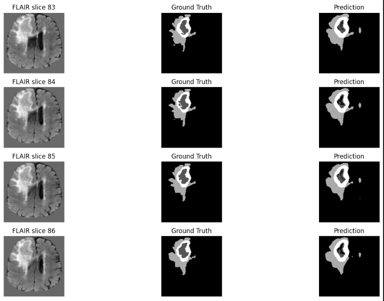
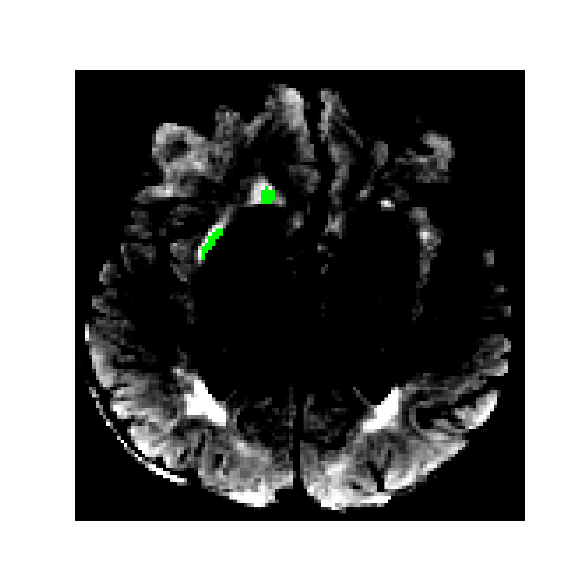
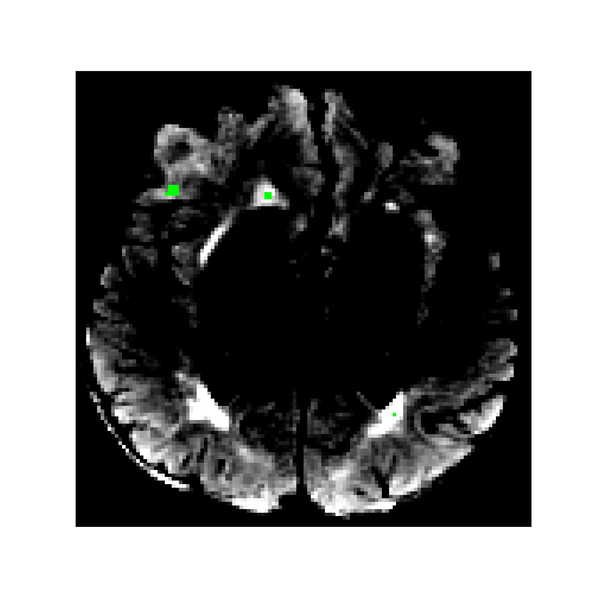
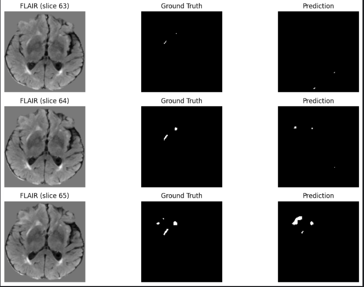
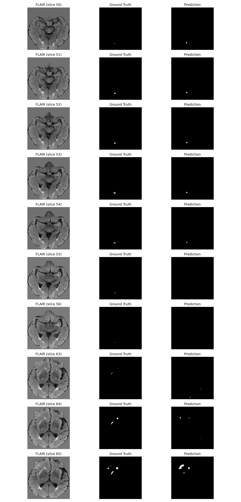

# 🧠 3D Brain Tumor Segmentation using 3D U-Net (BraTS 2021)
### **Deep Learning • Medical Imaging • PyTorch • End-to-End Research Pipeline**

---

## 🚀 Project Overview

This repository implements a **complete 3D brain tumor segmentation pipeline** using the **BraTS 2021** dataset and a fully custom **3D U-Net** designed and trained from scratch in PyTorch.

The project covers every step needed in a medical-grade pipeline:

✔ NIfTI preprocessing  
✔ Brain extraction through non-zero bounding box  
✔ True 3D resampling to 1mm³  
✔ Four MRI modalities (FLAIR, T1, T1CE, T2)  
✔ Intensity normalization  
✔ Final shape: **128 × 128 × 128**  
✔ 3D U-Net with skip connections  
✔ Mixed Precision (AMP)  
✔ Gradient Accumulation  
✔ Dice + CrossEntropy hybrid loss  
✔ Clean evaluation + visualizations  
✔ Modular folder structure  

This work trains on **100 patients** due to Kaggle notebook storage limits — but maintains a *research-level* structure and design to scale to all **1251 patients**.

---

# 🎯 Objective

Segment the 3 tumor regions defined in BraTS:

- **Whole Tumor (WT):** Labels 1 + 2 + 3  
- **Tumor Core (TC):** Labels 2 + 3  
- **Enhancing Tumor (ET):** Label 3  

---

# 📁 Repository Structure

# 📁 Repository Structure

brats-3d-unet/
│
├── src/
│ ├── data/
│ │ ├── bbox.py
│ │ ├── preprocessing.py
│ │ ├── utils_io.py
│ ├── model/
│ │ ├── Unet-3d.py
│ │ ├── losses.py
│ ├── train/
│ │ ├── dataloader.py
│ │ ├── train_loop.py
│ │ ├── metrics.py
│ ├── inference/
│ │ ├── predict.py
│ │ ├── visualization.py
│ ├── evaluation/
│ ├── eval_patient.py
│
├── samples/
│ ├── comparison_grid.png
│ ├── modalities.png
│ ├── multi_slice_segmentation_comparison.png
│ ├── multi_slice_segmentation_comparison2.png
│ ├── overlay_groundtruth.png
│ ├── overlay_prediction.png
│ └── overlay.png
│
├── saved_model/
│ └── model_chunk0.pth
│
├── notebook/
│ └── brats2021-3d-unet-pipeline.ipynb
│
├── requirements.txt
└── README.md

---

# ⚙️ Pipeline Details

---

# 🔧 Preprocessing Pipeline (Fully Reproducible)

The preprocessing code (in `src/data/`) performs:

### **1️⃣ Load all modalities using SimpleITK**
- FLAIR  
- T1  
- T1CE  
- T2  

### **2️⃣ Brain cropping**
Bounding box is computed using non-zero voxels.

### **3️⃣ True 3D resampling → 1mm³**
Using SimpleITK's `ResampleImageFilter`.

### **4️⃣ Intensity normalization**
Normalize *only brain voxels* → background stays 0.

### **5️⃣ Resize to 128×128×128**
Using PyTorch trilinear interpolation.

### **6️⃣ Label cleanup**
Remap label **4 → 3** (BraTS convention).

---

# 📸 Visualization Samples

Here are **all images** included in the repo, with the correct interpretation.

---

## 📌 1. Input Modalities (FLAIR, T1, T1CE, T2)

---

## 📌 2. Mask Overlay Visualizations

### **Ground Truth Overlay**

### **Prediction Overlay**

---

## 📌 3. Multi-slice Segmentation Comparisons

### Version 1

### Version 2

---

## 📌 4. Comparison Grid 

---

# 🧱 Model Architecture — 3D U-Net

Implemented in `src/model/Unet-3d.py`.

- 4 encoder levels  
- 4 decoder levels  
- 3D convolutions  
- Skip connections  
- Final 4-class voxel-wise prediction  

---

# 🏋️ Training Details

- **Dataset:** 100 patients  
- **Batch Size:** Effective 4 (using gradient accumulation ×4)  
- **Optimizer:** AdamW  
- **Loss:** Dice + CrossEntropy  
- **AMP:** Enabled  
- **Epochs:** 10 (baseline)  

---

# 📊 Results (100-patient baseline)

| Metric | Score |
|--------|--------|
| **Dice Class 0** | 0.99 |
| **Dice Class 1** | 0.57 |
| **Dice Class 2** | 0.79 |
| **Dice Class 3** | 0.85 |
| **Whole Tumor (WT)** | **0.86** |
| **Tumor Core (TC)** | **0.86** |
| **Enhancing Tumor (ET)** | **0.85** |

For only **100 patients**, these are strong starting results.

---

# 🔮 Future Work (Planned)

These upgrades will significantly boost performance:

### 🚀 Model Improvements
- Residual 3D U-Net  
- Attention U-Net  
- DenseNet-UNet hybrid  
- 64×128×128 patch-based training  

### 🚀 Data Improvements
- Full dataset: **1251 patients**  
- Advanced 3D augmentations (elastic, gamma, noise)  
- 160×192×128 resolution training  

---

# 👤 Author — **Rassem Bali**

AI Engineer • Deep Learning • Computer Vision • Medical Imaging  
🇹🇳 Tunisia • ENET'Com

🔗 LinkedIn: https://linkedin.com/in/rassem-bali  
🔗 GitHub: https://github.com/Rassembali  

---

✨ *If this work helps you, please consider starring the repository!* ✨

